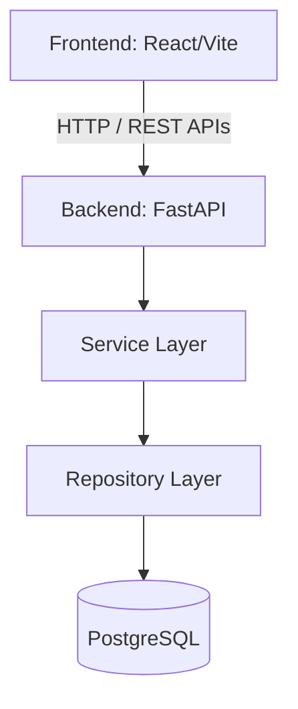

# AI-Powered Electronic Laboratory Notebook (ELN)

## Overview

The **AI-Powered Electronic Laboratory Notebook (ELN)** is an enterprise-grade digital platform engineered to modernize research operations in pharmaceutical, biotech, and academic laboratories. 

The purpose of this project is to eliminate fragmented paper trails and siloed data by providing a unified, secure, and intuitive environment for scientific data management. It solves critical business problems surrounding data integrity, regulatory compliance, and operational inefficiency by centralizing experimental data, sample registries, protocol management, and lab instrument tracking into a single source of truth.

**Target Users:**
- **Bench Scientists & Researchers:** For planning experiments, documenting observations, and tracking samples.
- **Lab Managers:** For monitoring inventory, overseeing instrument maintenance, and approving protocols.
- **Quality Assurance (QA):** For ensuring data integrity, compliance tracking, and audit trails.
- **System Administrators:** For managing organizational hierarchy and Role-Based Access Control (RBAC).

---

## Key Features

The ELN platform consists of several interconnected modules designed to streamline the entire R&D lifecycle:

- **Authentication & Authorization:** Secure, stateless JWT-based authentication with granular Role-Based Access Control (RBAC).
- **Dashboard:** High-level overview of ongoing projects, recent experiments, and quick actions.
- **Project Management:** Organize and track high-level research initiatives and their associated experiments.
- **Experiment Management:** End-to-end lifecycle management of experiments from ideation to conclusion.
- **ELN Notebook:** A digital scientific notebook for rich text documentation and result logging.
- **Sample Registry:** Track biological and chemical samples, including storage locations and chain of custody.
- **Protocol Management:** Standard Operating Procedure (SOP) repository with version control and approval workflows.
- **Inventory Management:** Track lab reagents, consumables, and stock levels.
- **Instrument Management:** Centralized tracking for lab equipment, including calibration schedules, maintenance logs, and reservations.
- **DNA/RNA/Protein Sequence Management:** Dedicated module for storing, versioning, and analyzing genetic sequences (FASTA support).

**Platform Capabilities:**
- Secure authentication with JWT & RBAC
- Experiment lifecycle management
- Digital laboratory notebook
- Sample and sequence tracking
- Protocol and inventory management
- Instrument tracking
- Audit-ready architecture
- Responsive React frontend
- FastAPI backend

---

## Technology Stack

### Backend
- **Framework:** FastAPI (Python)
- **ORM:** SQLAlchemy Async
- **Database:** PostgreSQL
- **Migrations:** Alembic
- **Validation:** Pydantic v2

### Frontend
- **Library:** React (TypeScript)
- **Build Tool:** Vite
- **Data Fetching:** TanStack Query (React Query)
- **HTTP Client:** Axios
- **Styling:** Tailwind CSS

### Database
- **Engine:** PostgreSQL

---

## Project Architecture

The ELN utilizes a clean, decoupled architecture. The frontend communicates with the backend via RESTful APIs, which in turn rely on a modular service and repository layer to interact with the database.



---

## Project Structure

```text
ELN/
├── backend/    # FastAPI application, database models, schemas, and API routers
├── frontend/   # React application, UI components, React Query hooks, and views
├── docs/       # Architecture documents, API specifications, and database designs
└── tests/      # Automated integration and unit testing suites
```

- **`backend/`**: Contains the core Python server logic, Pydantic data validation schemas, SQLAlchemy ORM models, and the routing controllers.
- **`frontend/`**: Contains the TypeScript React UI, organized by feature modules, leveraging TanStack Query for robust server-state management.
- **`docs/`**: Holds project documentation, data dictionaries, and architectural diagrams.
- **`tests/`**: Dedicated environment for verifying both backend endpoint integrity and frontend UI logic.

---

## Current Status

- ✅ **Backend Core Modules Completed:** 100% of the core relational schemas and API endpoints are built and tested.
- ✅ **Frontend Integrated:** All core laboratory modules are natively wired to the backend APIs.
- ✅ **Platform Stabilization Completed:** Zero-mock data, verified strict TypeScript compliance, and optimized bundle sizes.
- 🚧 **AI Copilot (Planned):** Implementation of LLM-assisted workflows.
- 🚧 **CI/CD & Docker Deployment (Planned):** Containerization and automated pipelines.

---

## Getting Started

### Backend

1. **Install dependencies:**
   ```bash
   cd backend
   pip install -r requirements.txt
   ```
2. **Configure Environment:**
   Copy `.env.example` to `.env` and configure your PostgreSQL database credentials and JWT secrets.
3. **Run database migrations:**
   ```bash
   alembic upgrade head
   ```
4. **Start FastAPI:**
   ```bash
   uvicorn app.main:app --reload
   ```

### Frontend

1. **Install dependencies:**
   ```bash
   cd frontend
   npm install
   ```
2. **Run development server:**
   ```bash
   npm run dev
   ```
3. **Build production bundle:**
   ```bash
   npm run build
   ```

---

## Future Enhancements

- **AI Copilot:** An embedded intelligent assistant to help summarize experiments, generate protocols, and analyze data.
- **Semantic Search (RAG):** Retrieval-Augmented Generation for natural language querying across all notebook entries and protocols.
- **CI/CD Pipeline:** Automated testing and deployment workflows using GitHub Actions.
- **Docker & Kubernetes Deployment:** Full containerization of the frontend, backend, and database for orchestrated deployments.
- **Azure Cloud Deployment:** Enterprise-grade cloud hosting and scalability optimizations.

---

## License

*This project is proprietary and confidential. Unauthorized copying of this file, via any medium, is strictly prohibited.*
