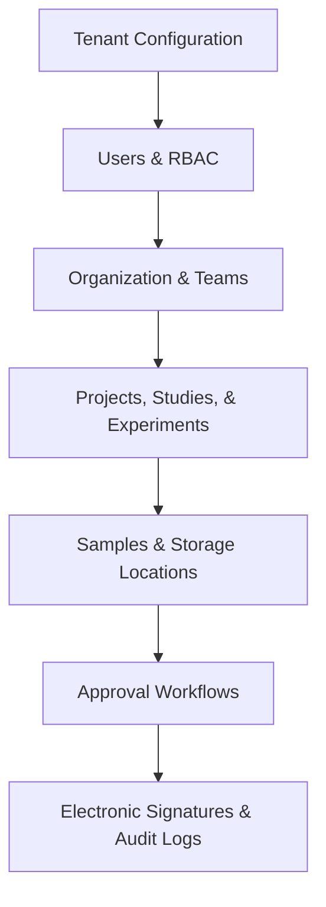
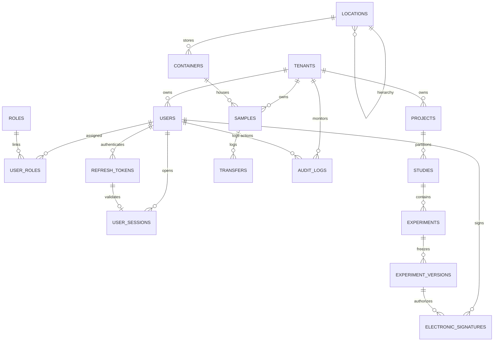

# Section 5: Enterprise Database Design Blueprint

This document defines the complete enterprise database architecture and physical schema design for the Electronic Laboratory Notebook (ELN) platform. It provides a formal architectural blueprint mapped to multi-tenancy requirements, FDA 21 CFR Part 11 regulations, GxP validation criteria, and vector search scalability for AI integration.

---

## 1. Enterprise Database Architecture Strategy

The architectural optimal choice for this enterprise platform is a **Single PostgreSQL Instance with Logical Multi-Schema Isolation** rather than a multiple-database strategy.

### Architectural Trade-off Analysis

| Metric | Single Database (Multiple Logical Schemas) | Multiple Databases (Physical Database-per-Tenant) |
| :--- | :--- | :--- |
| **Data Isolation** | **Logical.** Enforced via schemas and Row-Level Security (RLS). High safety when paired with schema routing. | **Physical.** Complete isolation at the process/storage level. Zero risk of cross-talk. |
| **Operational Overhead** | **Low.** Single backup plan, single connection pool management, simple maintenance, and unified upgrades. | **High.** Thousands of active database instances require complex orchestrations, high maintenance, and cost. |
| **Cross-Tenant Queries** | **Simple.** Standard database queries can run across schemas (for system admin stats or billing analytics). | **Complex.** Requires foreign data wrappers (FDW), dblink, or manual application-level aggregation. |
| **Scale Limits** | Shared connection pools and disk. Scales vertically or via read replicas. | Hard physical isolation allows routing customers to separate physical nodes easily. |
| **Resource Efficiency** | **High.** PostgreSQL shares memory and buffers across connections. Minimal idle waste. | **Low.** Idle tenants still occupy memory buffers and connection sockets. Higher infrastructure cost. |

### Technical Justification for Multi-Schema Strategy
For a biotech and pharma enterprise SaaS, the **Single PostgreSQL Database with Logical Multi-Schema Isolation** is recommended because of the following factors:
1. **Compliance and Attributability:** Validation protocols under FDA 21 CFR Part 11 require checking schema integrity and database audit trails. Managing schema-level validation is significantly more auditable, predictable, and robust than validating thousands of disparate physical databases.
2. **Schema-per-Tenant vs Column-per-Tenant:** We utilize a hybrid model:
   - Dynamic system tables (like `tenants`) occupy the `platform` schema.
   - Tenant data is isolated in separate schemas named dynamically as `tenant_{tenant_uuid}`.
   - This prevents cross-tenant schema contamination and simplifies backup/restore sequences for individual customers who may request their own backup files under strict GxP containment rules.

---

## 2. Database Topology & Modules

The platform's relational ecosystem is divided into specific databases. In our unified schema-per-tenant deployment model, these represent **logical database domains**:

### Logical Domains Matrix

| Logical Domain | Business Capability | Included Schemas | Data Ownership |
| :--- | :--- | :--- | :--- |
| **Platform & Identity** | Tenant provisioning, RBAC, session states, single sign-on (SSO), and authentication. | `platform`, `identity` | System-wide owned (Platform admin). |
| **Research & LIMS** | Projects, studies, experiment sheets, collaborative notebooks, and protocols. | `research`, `documents` | Tenant-owned (Restricted to tenant users). |
| **Asset & Inventory** | Sample registries, biological/chemical storage, barcode labeling, and locations. | `inventory` | Tenant-owned (Restricted to lab staff). |
| **Workflow & Compliance** | Chain of custody, sign-off approval routes, audit logs, and signature profiles. | `workflow`, `compliance`, `audit` | Tenant-owned / Immutable logs. |
| **Analytics & AI** | Vector embeddings, search context, and reporting summaries. | `ai`, `reporting` | Mixed (Context cached per tenant). |

---

## 3. Schema Design

Every tenant schema (`tenant_{uuid}`) implements a copy of the following schemas:

* **`identity`**: Contains user profiles, user-role associations, API keys, and device trusts.
* **`organization`**: Defines departments, rooms, laboratories, and physical team rosters.
* **`research`**: Houses projects, studies, raw experiments, and canvas protocols.
* **`inventory`**: Governs sample types, physical sample records, containers, and location hierarchies.
* **`workflow`**: Manages validation routing, step transitions, and reviews.
* **`compliance`**: Stores electronic signatures and cryptographic certificate mappings.
* **`audit`**: Houses immutable trigger-based audit logs.
* **`documents`**: Controls attachments, collaboration feeds, and notes.
* **`ai`**: Stores semantic embeddings and prompt memories.

---

## 4. Module Database Design

The system modules are structured in a sequential dependency chain, ensuring strict referential integrity. Downstream transactions (such as signatures) depend directly on upstream structures (such as users, roles, and experiments).



---

## 5. Detailed Table Design Specifications

### 5.1 Identity & Access Module

#### Table: `users`
* **Purpose**: Primary authenticatable entities.
* **Tenant Isolation**: Yes (`tenant_id`).
* **Soft Delete**: Yes (`is_deleted`).

| Column Name | Data Type | Nullable | Default | Constraints / Indexes |
| :--- | :--- | :--- | :--- | :--- |
| `id` | UUID | NO | gen_random_uuid() | PRIMARY KEY, index |
| `tenant_id` | UUID | NO | - | FK to `tenants.id` ON DELETE CASCADE, index |
| `organization_id` | UUID | YES | - | FK to `organizations.id` ON DELETE SET NULL, index |
| `employee_id` | VARCHAR(64) | YES | - | Index |
| `username` | VARCHAR(128) | NO | - | Unique per tenant, index |
| `email` | VARCHAR(255) | NO | - | Unique per tenant, index |
| `first_name` | VARCHAR(128) | NO | - | - |
| `last_name` | VARCHAR(128) | NO | - | - |
| `display_name` | VARCHAR(255) | YES | - | - |
| `phone_number` | VARCHAR(32) | YES | - | - |
| `password_hash` | VARCHAR(255) | NO | - | - |
| `password_changed_at` | TIMESTAMPTZ | YES | - | - |
| `must_change_password`| BOOLEAN | NO | FALSE | - |
| `email_verified` | BOOLEAN | NO | FALSE | - |
| `phone_verified` | BOOLEAN | NO | FALSE | - |
| `is_active` | BOOLEAN | NO | TRUE | Index |
| `is_locked` | BOOLEAN | NO | FALSE | Index |
| `failed_login_attempts`| INT | NO | 0 | CHECK (`failed_login_attempts` >= 0) |
| `locked_until` | TIMESTAMPTZ | YES | - | - |
| `status` | VARCHAR(32) | NO | 'active' | CHECK (status IN ('active', 'inactive', 'suspended')) |
| `created_at` | TIMESTAMPTZ | NO | clock_timestamp() | - |
| `updated_at` | TIMESTAMPTZ | NO | clock_timestamp() | - |
| `created_by` | UUID | YES | - | - |
| `updated_by` | UUID | YES | - | - |
| `is_deleted` | BOOLEAN | NO | FALSE | Index |
| `deleted_at` | TIMESTAMPTZ | YES | - | - |
| `deleted_by` | UUID | YES | - | - |

#### Table: `user_profiles`
* **Purpose**: Stores non-security user profile metadata.
* **Tenant Isolation**: Inherited through User link.

| Column Name | Data Type | Nullable | Default | Constraints |
| :--- | :--- | :--- | :--- | :--- |
| `id` | UUID | NO | gen_random_uuid() | PRIMARY KEY |
| `user_id` | UUID | NO | - | FK to `users.id` ON DELETE CASCADE, UNIQUE |
| `date_of_birth` | DATE | YES | - | - |
| `gender` | VARCHAR(32) | YES | - | - |
| `department` | VARCHAR(128) | YES | - | - |
| `designation` | VARCHAR(128) | YES | - | - |
| `location` | VARCHAR(255) | YES | - | - |
| `time_zone` | VARCHAR(64) | YES | 'UTC' | - |
| `language` | VARCHAR(16) | YES | 'en' | - |
| `avatar_url` | VARCHAR(512) | YES | - | - |
| `biography` | TEXT | YES | - | - |

#### Table: `user_roles`
* **Purpose**: Explicit association table linking users and roles.

| Column Name | Data Type | Nullable | Default | Constraints |
| :--- | :--- | :--- | :--- | :--- |
| `id` | UUID | NO | gen_random_uuid() | PRIMARY KEY |
| `user_id` | UUID | NO | - | FK to `users.id` ON DELETE CASCADE, index |
| `role_id` | UUID | NO | - | FK to `roles.id` ON DELETE CASCADE, index |
| `assigned_by` | UUID | YES | - | - |
| `assigned_at` | TIMESTAMPTZ | NO | clock_timestamp() | - |
| `expires_at` | TIMESTAMPTZ | YES | - | - |
| `is_primary` | BOOLEAN | NO | FALSE | - |
| `is_active` | BOOLEAN | NO | TRUE | - |

*   **Unique Constraint**: `uq_user_roles_user_role` (`user_id`, `role_id`)

#### Table: `user_sessions`
* **Purpose**: Tracks user browser sessions.

| Column Name | Data Type | Nullable | Default | Constraints |
| :--- | :--- | :--- | :--- | :--- |
| `id` | UUID | NO | gen_random_uuid() | PRIMARY KEY |
| `user_id` | UUID | NO | - | FK to `users.id` ON DELETE CASCADE, index |
| `refresh_token_id` | UUID | YES | - | FK to `refresh_tokens.id` ON DELETE SET NULL, UNIQUE |
| `session_token_hash`| VARCHAR(255) | NO | - | UNIQUE, index |
| `device_name` | VARCHAR(255) | YES | - | - |
| `browser` | VARCHAR(128) | YES | - | - |
| `operating_system` | VARCHAR(128) | YES | - | - |
| `ip_address` | VARCHAR(45) | YES | - | - |
| `user_agent` | VARCHAR(512) | YES | - | - |
| `last_activity` | TIMESTAMPTZ | NO | clock_timestamp() | - |
| `expires_at` | TIMESTAMPTZ | NO | - | - |
| `is_revoked` | BOOLEAN | NO | FALSE | - |

#### Table: `refresh_tokens`
* **Purpose**: Stores JWT refresh tokens.

| Column Name | Data Type | Nullable | Default | Constraints |
| :--- | :--- | :--- | :--- | :--- |
| `id` | UUID | NO | gen_random_uuid() | PRIMARY KEY |
| `user_id` | UUID | NO | - | FK to `users.id` ON DELETE CASCADE, index |
| `token_hash` | VARCHAR(255) | NO | - | UNIQUE, index |
| `issued_at` | TIMESTAMPTZ | NO | clock_timestamp() | - |
| `expires_at` | TIMESTAMPTZ | NO | - | - |
| `revoked_at` | TIMESTAMPTZ | YES | - | - |
| `device_name` | VARCHAR(255) | YES | - | - |
| `ip_address` | VARCHAR(45) | YES | - | - |

*   **Check Constraint**: `ck_refresh_tokens_expiry` (`expires_at` > `issued_at`)

#### Table: `login_histories`
* **Purpose**: Read-only security login trail (No update/delete allowed).

| Column Name | Data Type | Nullable | Default | Constraints |
| :--- | :--- | :--- | :--- | :--- |
| `id` | UUID | NO | gen_random_uuid() | PRIMARY KEY |
| `user_id` | UUID | NO | - | FK to `users.id` ON DELETE CASCADE, index |
| `login_time` | TIMESTAMPTZ | NO | clock_timestamp() | - |
| `logout_time` | TIMESTAMPTZ | YES | - | - |
| `ip_address` | VARCHAR(45) | YES | - | - |
| `device` | VARCHAR(255) | YES | - | - |
| `browser` | VARCHAR(128) | YES | - | - |
| `operating_system` | VARCHAR(128) | YES | - | - |
| `country` | VARCHAR(128) | YES | - | - |
| `city` | VARCHAR(128) | YES | - | - |
| `status` | VARCHAR(32) | NO | - | CHECK (`status` IN ('success', 'failed')) |
| `failure_reason` | VARCHAR(255) | YES | - | - |

#### Table: `password_histories`
* **Purpose**: Prevents user password re-use.

| Column Name | Data Type | Nullable | Default | Constraints |
| :--- | :--- | :--- | :--- | :--- |
| `id` | UUID | NO | gen_random_uuid() | PRIMARY KEY |
| `user_id` | UUID | NO | - | FK to `users.id` ON DELETE CASCADE, index |
| `password_hash` | VARCHAR(255) | NO | - | - |
| `changed_at` | TIMESTAMPTZ | NO | clock_timestamp() | - |

#### Table: `mfa_devices`
* **Purpose**: Governs TOTP/Authenticator configurations.

| Column Name | Data Type | Nullable | Default | Constraints |
| :--- | :--- | :--- | :--- | :--- |
| `id` | UUID | NO | gen_random_uuid() | PRIMARY KEY |
| `user_id` | UUID | NO | - | FK to `users.id` ON DELETE CASCADE, index |
| `device_name` | VARCHAR(255) | NO | 'Primary MFA Device' | - |
| `type` | VARCHAR(32) | NO | 'totp' | - |
| `secret` | VARCHAR(255) | NO | - | - |
| `verified` | BOOLEAN | NO | FALSE | - |
| `verified_at` | TIMESTAMPTZ | YES | - | - |
| `last_used` | TIMESTAMPTZ | YES | - | - |

#### Table: `api_keys`
* **Purpose**: M2M interface authentication key registries.
* **Tenant Isolation**: Yes (`tenant_id`).

| Column Name | Data Type | Nullable | Default | Constraints |
| :--- | :--- | :--- | :--- | :--- |
| `id` | UUID | NO | gen_random_uuid() | PRIMARY KEY |
| `tenant_id` | UUID | NO | - | FK to `tenants.id` ON DELETE CASCADE, index |
| `user_id` | UUID | NO | - | FK to `users.id` ON DELETE CASCADE, index |
| `name` | VARCHAR(128) | NO | - | - |
| `hashed_key` | VARCHAR(255) | NO | - | UNIQUE, index |
| `expires_at` | TIMESTAMPTZ | YES | - | - |
| `last_used` | TIMESTAMPTZ | YES | - | - |
| `is_active` | BOOLEAN | NO | TRUE | - |
| `created_at` | TIMESTAMPTZ | NO | clock_timestamp() | - |
| `updated_at` | TIMESTAMPTZ | NO | clock_timestamp() | - |

#### Table: `trusted_devices`
* **Purpose**: Stores authorized user hardware to bypass MFA steps safely.

| Column Name | Data Type | Nullable | Default | Constraints |
| :--- | :--- | :--- | :--- | :--- |
| `id` | UUID | NO | gen_random_uuid() | PRIMARY KEY |
| `user_id` | UUID | NO | - | FK to `users.id` ON DELETE CASCADE, index |
| `device_identifier` | VARCHAR(255) | NO | - | UNIQUE, index |
| `device_name` | VARCHAR(255) | YES | - | - |
| `browser` | VARCHAR(128) | YES | - | - |
| `operating_system` | VARCHAR(128) | YES | - | - |
| `ip_address` | VARCHAR(45) | YES | - | - |
| `trusted_since` | TIMESTAMPTZ | NO | clock_timestamp() | - |
| `last_seen` | TIMESTAMPTZ | NO | clock_timestamp() | - |

#### Table: `user_preferences`
* **Purpose**: Holds interface theme, localization, and notifications details.

| Column Name | Data Type | Nullable | Default | Constraints |
| :--- | :--- | :--- | :--- | :--- |
| `id` | UUID | NO | gen_random_uuid() | PRIMARY KEY |
| `user_id` | UUID | NO | - | FK to `users.id` ON DELETE CASCADE, UNIQUE, index |
| `theme` | VARCHAR(32) | NO | 'light' | - |
| `language` | VARCHAR(16) | NO | 'en' | - |
| `time_zone` | VARCHAR(64) | NO | 'UTC' | - |
| `notification_settings`| JSON | NO | '{}' | - |

#### Table: `electronic_signature_profiles`
* **Purpose**: Captures cryptographic signature settings for a user.

| Column Name | Data Type | Nullable | Default | Constraints |
| :--- | :--- | :--- | :--- | :--- |
| `id` | UUID | NO | gen_random_uuid() | PRIMARY KEY |
| `user_id` | UUID | NO | - | FK to `users.id` ON DELETE CASCADE, UNIQUE, index |
| `signature_meaning` | VARCHAR(255) | YES | - | - |
| `signature_algorithm` | VARCHAR(64) | YES | - | - |
| `certificate_thumbprint`| VARCHAR(255)| YES | - | - |
| `enabled` | BOOLEAN | NO | TRUE | - |
| `created_at` | TIMESTAMPTZ | NO | clock_timestamp() | - |

---

### 5.2 Research & Documentation Module

#### Table: `projects`
* **Purpose**: High-level program groups.
* **Tenant Isolation**: Yes (`tenant_id`).
* **Soft Delete**: Yes (`is_deleted`).

| Column Name | Data Type | Nullable | Default | Constraints / Indexes |
| :--- | :--- | :--- | :--- | :--- |
| `id` | UUID | NO | gen_random_uuid() | PRIMARY KEY |
| `tenant_id` | UUID | NO | - | FK to `tenants.id` ON DELETE CASCADE, index |
| `name` | VARCHAR(255) | NO | - | Unique per tenant, index |
| `code` | VARCHAR(64) | NO | - | Unique per tenant, index |
| `description` | TEXT | YES | - | - |
| `created_at` | TIMESTAMPTZ | NO | clock_timestamp() | - |
| `updated_at` | TIMESTAMPTZ | NO | clock_timestamp() | - |
| `created_by` | UUID | YES | - | - |
| `updated_by` | UUID | YES | - | - |
| `is_deleted` | BOOLEAN | NO | FALSE | Index |

#### Table: `studies`
* **Purpose**: Specific scientific tracks under a Project.
* **Soft Delete**: Yes.

| Column Name | Data Type | Nullable | Default | Constraints / Indexes |
| :--- | :--- | :--- | :--- | :--- |
| `id` | UUID | NO | gen_random_uuid() | PRIMARY KEY |
| `project_id` | UUID | NO | - | FK to `projects.id` ON DELETE CASCADE, index |
| `name` | VARCHAR(255) | NO | - | Index |
| `code` | VARCHAR(64) | NO | - | Unique per project |
| `status` | VARCHAR(32) | NO | 'planned' | CHECK (status IN ('planned', 'active', 'on_hold', 'completed', 'cancelled')) |

#### Table: `experiments`
* **Purpose**: Active mutable scientific sheets/experiments.
* **Soft Delete**: Yes.

| Column Name | Data Type | Nullable | Default | Constraints / Indexes |
| :--- | :--- | :--- | :--- | :--- |
| `id` | UUID | NO | gen_random_uuid() | PRIMARY KEY |
| `study_id` | UUID | NO | - | FK to `studies.id` ON DELETE CASCADE, index |
| `title` | VARCHAR(255) | NO | - | - |
| `content` | JSONB | YES | - | GIN index |
| `status` | VARCHAR(32) | NO | 'draft' | CHECK (status IN ('draft', 'in_progress', 'in_review', 'approved', 'rejected')) |

#### Table: `experiment_versions`
* **Purpose**: Immutable snapshot records of submitted/approved experiments.
* **Soft Delete**: No (Immutable compliance record).

| Column Name | Data Type | Nullable | Default | Constraints / Indexes |
| :--- | :--- | :--- | :--- | :--- |
| `id` | UUID | NO | gen_random_uuid() | PRIMARY KEY |
| `experiment_id` | UUID | NO | - | FK to `experiments.id` ON DELETE CASCADE, index |
| `version_number` | INTEGER | NO | - | - |
| `snapshot_data` | JSONB | NO | - | - |
| `created_at` | TIMESTAMPTZ | NO | clock_timestamp() | - |
| `created_by` | UUID | NO | - | FK to `users.id` |

*   **Unique Constraint**: `uq_experiment_version` (`experiment_id`, `version_number`)

---

### 5.3 Sample Registry & Inventory Module

#### Table: `samples`
* **Purpose**: Registry of biological/chemical samples.
* **Tenant Isolation**: Yes (`tenant_id`).
* **Soft Delete**: Yes.

| Column Name | Data Type | Nullable | Default | Constraints / Indexes |
| :--- | :--- | :--- | :--- | :--- |
| `id` | UUID | NO | gen_random_uuid() | PRIMARY KEY |
| `tenant_id` | UUID | NO | - | FK to `tenants.id` ON DELETE CASCADE, index |
| `name` | VARCHAR(255) | NO | - | Index |
| `sample_type_id` | UUID | YES | - | FK to `sample_types.id` ON DELETE RESTRICT, index |
| `metadata` | JSONB | NO | '{}' | GIN index |
| `status` | VARCHAR(32) | NO | 'available' | CHECK (status IN ('available', 'consumed', 'destroyed')) |

#### Table: `locations`
* **Purpose**: Hierarchical laboratory warehouse structure (Adjacency list).

| Column Name | Data Type | Nullable | Default | Constraints / Indexes |
| :--- | :--- | :--- | :--- | :--- |
| `id` | UUID | NO | gen_random_uuid() | PRIMARY KEY |
| `tenant_id` | UUID | NO | - | FK to `tenants.id` ON DELETE CASCADE, index |
| `parent_id` | UUID | YES | - | FK to `locations.id` ON DELETE CASCADE, index |
| `name` | VARCHAR(255) | NO | - | - |
| `type` | VARCHAR(64) | NO | - | e.g., 'Room', 'Freezer', 'Shelf' |

---

### 5.4 Compliance & Audit Module

#### Table: `electronic_signatures`
* **Purpose**: Cryptographic signature validation for 21 CFR Part 11 and GxP approvals.
* **Soft Delete**: No (Strict regulatory requirement).

| Column Name | Data Type | Nullable | Default | Constraints / Indexes |
| :--- | :--- | :--- | :--- | :--- |
| `id` | UUID | NO | gen_random_uuid() | PRIMARY KEY |
| `tenant_id` | UUID | NO | - | FK to `tenants.id` ON DELETE CASCADE |
| `entity_type` | VARCHAR(128) | NO | - | e.g. 'ExperimentVersion' |
| `entity_id` | UUID | NO | - | Index |
| `signed_by` | UUID | NO | - | FK to `users.id` ON DELETE RESTRICT, index |
| `signed_at` | TIMESTAMPTZ | NO | clock_timestamp() | - |
| `meaning` | VARCHAR(255) | NO | - | e.g., 'Author', 'Reviewer', 'Approver' |
| `snapshot_hash` | VARCHAR(256) | NO | - | Cryptographic hash of locked version data |

#### Table: `audit_logs`
* **Purpose**: System-wide database-trigger-level history logs.
* **Soft Delete**: No (Strict compliance requirement).
* **Partitioning**: Yes (Range Partitioning by Month on `performed_at`).

| Column Name | Data Type | Nullable | Default | Constraints / Indexes |
| :--- | :--- | :--- | :--- | :--- |
| `id` | UUID | NO | gen_random_uuid() | PARTITION KEY (Composite PK with performed_at) |
| `tenant_id` | UUID | NO | - | FK to `tenants.id`, index |
| `table_name` | VARCHAR(128) | NO | - | Index |
| `record_id` | UUID | NO | - | Index |
| `action` | VARCHAR(16) | NO | - | CHECK (`action` IN ('insert', 'update', 'delete')) |
| `old_values` | JSONB | YES | - | - |
| `new_values` | JSONB | YES | - | - |
| `performed_by` | UUID | YES | - | FK to `users.id` ON DELETE SET NULL, index |
| `performed_at` | TIMESTAMPTZ | NO | clock_timestamp() | PARTITION KEY, index |

---

### 5.5 AI & Embedding Module

#### Table: `vector_embeddings`
* **Purpose**: Stores pgvector high-dimensional embeddings for semantic search.
* **Soft Delete**: No.

| Column Name | Data Type | Nullable | Default | Constraints / Indexes |
| :--- | :--- | :--- | :--- | :--- |
| `id` | UUID | NO | gen_random_uuid() | PRIMARY KEY |
| `tenant_id` | UUID | NO | - | FK to `tenants.id` ON DELETE CASCADE, index |
| `entity_type` | VARCHAR(128) | NO | - | e.g., 'Experiment', 'Sample' |
| `entity_id` | UUID | NO | - | Index |
| `content_chunk` | TEXT | NO | - | - |
| `embedding` | VECTOR(1536) | NO | - | HNSW Index (Cosine Similarity) |

---

## 6. Entity Relationships (ERD Mapping)



### Key Relationships Described
*   **User to Profile (One-to-One):** `UserProfile` maps directly to `User` via `user_id` which acts as a Unique index.
*   **User to Roles (Many-to-Many via Association Model):** Maps through the explicit `UserRole` table to log context metrics (assigned by, expiry dates, and primary status).
*   **Experiment to Versions (One-to-Many):** An `Experiment` can yield multiple immutable `ExperimentVersions`. Electronic signatures bind to these historical versions to lock validation status.
*   **Locations Hierarchy (Self-Referential):** `locations.parent_id` points back to `locations.id` in an adjacency list model to represent nested labs, shelves, freezers, and slots.

---

## 7. Master Data

Master data tables store the slow-changing, reference configurations that define structural settings. These tables must be backed up frequently and cached aggressively in the application layer.

*   `tenants`: Core multi-tenancy configurations.
*   `users`: Authenticatable user entities.
*   `roles` & `permissions`: Authorization configurations.
*   `organizations`, `departments`, `teams`: Structural organizational models.
*   `projects` & `studies`: High-level scientific registry scopes.
*   `sample_types`: Registry templates and validation rules.
*   `locations` & `containers`: Storage registries.

---

## 8. Transaction Tables

Transaction tables capture high-frequency operations. These tables sustain high write volumes, require strict table partitioning, and dictate data archiving policies.

*   `experiments`: Workspace modifications.
*   `experiment_versions`: Locked science states.
*   `electronic_signatures`: Immutable validation markers.
*   `audit_logs`: DB-level modification records.
*   `transfers`: Physical material location logs.
*   `user_sessions` & `login_histories`: Security access logs.
*   `instrument_runs`: Experimental raw telemetry datasets.

---

## 9. Regulatory Compliance Design (FDA 21 CFR Part 11 & ALCOA+)

| ALCOA+ Principle | Database Enforcement Strategy | FDA 21 CFR Part 11 Rule Mapping |
| :--- | :--- | :--- |
| **Attributable** | All audited tables contain `created_by` and `updated_by` UUID fields linked to users. The trigger-based `audit_logs` table logs `performed_by` directly. | § 11.10(a) Validation of systems to ensure accuracy, reliability, and consistent performance. |
| **Legible & Permanent** | Soft deletes (`is_deleted = True`) are enforced on critical resources. Audit logs and electronic signatures are structurally immutable and block all SQL `UPDATE` and `DELETE` requests. | § 11.10(c) Protection of records to enable their accurate and ready retrieval. |
| **Contemporaneous** | Timestamps use `TIMESTAMPTZ` with the database clock server time (`clock_timestamp()`), bypassing local application clocks to prevent timestamp tampering. | § 11.10(e) Use of secure, computer-generated, time-stamped audit trails to record the date and time of operator entries. |
| **Original** | Experiments submit locked immutable versions to `experiment_versions`. Changes to the active draft do not modify previously signed or submitted records. | § 11.50 Signature manifestations (printed name, date/time, and meaning of the signature). |
| **Accurate** | PostgreSQL triggers capture changes, writing before-and-after states to `audit_logs.old_values` and `audit_logs.new_values` as JSONB. | § 11.10(h) Use of device checks to determine the validity of the source of data input. |

### Database-Level Immutable enforcement
To prevent DBA tampering or SQL inject modifications on compliance logs, PostgreSQL rules/triggers reject modifications on the `audit_logs` and `electronic_signatures` tables:
```sql
CREATE RULE block_audit_updates AS 
ON UPDATE TO audit_logs 
DO INSTEAD NOTHING;

CREATE RULE block_audit_deletes AS 
ON DELETE TO audit_logs 
DO INSTEAD NOTHING;
```

---

## 10. Database Scalability & Performance Engineering

### 10.1 Table Partitioning Plan
The `audit_logs` table represents the highest write-frequency table in the platform. To maintain index sizes and query performance, it is partitioned by month on the `performed_at` timestamp:

```sql
CREATE TABLE audit_logs (
    id UUID NOT NULL,
    tenant_id UUID NOT NULL,
    table_name VARCHAR(128) NOT NULL,
    record_id UUID NOT NULL,
    action VARCHAR(16) NOT NULL,
    old_values JSONB,
    new_values JSONB,
    performed_by UUID,
    performed_at TIMESTAMPTZ NOT NULL,
    PRIMARY KEY (id, performed_at)
) PARTITION BY RANGE (performed_at);
```
During monthly cron routines, new partition bounds are created (e.g., `audit_logs_y2026m08` for August 2026).

### 10.2 Indexing Strategy
*   **Vector Search Acceleration:** We utilize PostgreSQL's `pgvector` extension. The HNSW (Hierarchical Navigable Small World) index is configured on the `embedding` column using Cosine Distance (`vector_cosine_ops`) to enable sub-second semantic search over millions of experiment pages:
    ```sql
    CREATE INDEX ix_embeddings_hnsw_cosine ON vector_embeddings 
    USING hnsw (embedding vector_cosine_ops);
    ```
*   **Partial Indexes for Soft Deletes:** Typical application reads ignore deleted records. To minimize index storage overhead, index filters are restricted to active records:
    ```sql
    CREATE INDEX ix_active_experiments_study ON experiments (study_id) 
    WHERE is_deleted = FALSE;
    ```
*   **JSONB Query Acceleration:** To allow fast querying on flexible user metadata and sample properties, GIN indexes are applied to the `metadata` column:
    ```sql
    CREATE INDEX ix_samples_metadata_gin ON samples USING gin (metadata);
    ```

### 10.3 Replication & Disaster Recovery Topology
*   **Primary Database (Read-Write):** Executes transactional updates, modifications, and audits.
*   **Hot Standby (Read-Only Replica):** Synchronized via streaming replication. Handles read-heavy endpoints, background report runs, and AI embedding extracts.
*   **Point-in-Time Recovery (PITR):** Transaction logs (Write-Ahead Logs/WAL) are streamed continuously to secure, immutable object storage. This enables restoring the database state to the exact millisecond before any data corruption event occurred.
