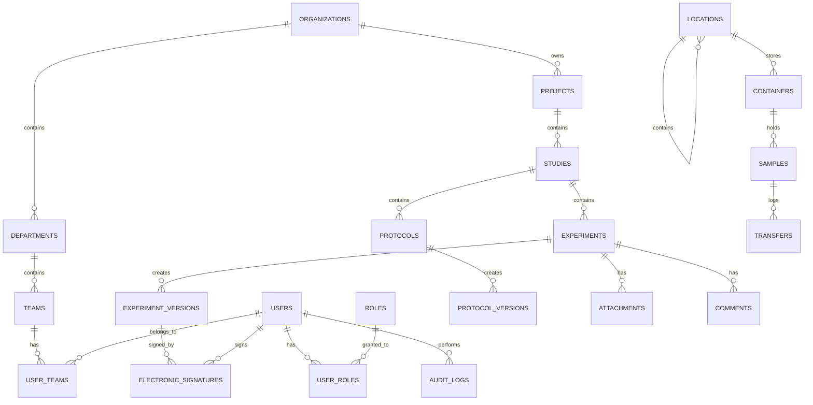

# Enterprise ELN Database Specification

## 1. System Modules

To ensure high cohesion and loose coupling, the database is partitioned into logical domains:

*   **Identity & Access**: Users, Roles, Permissions, UserRoles, RolePermissions
*   **Organization**: Organizations, Departments, Teams, UserTeams
*   **Research**: Projects, Studies, Experiments, ExperimentVersions, Protocols, ProtocolVersions
*   **Sample Registry & Inventory**: Samples, Locations, Containers, Transfers
*   **Molecular Biology**: Sequences, SequenceVersions, Features
*   **Instrument Integration**: Instruments, InstrumentRuns, RunData
*   **Workflow & Compliance**: ApprovalRoutes, ElectronicSignatures, AuditLogs
*   **Collaboration**: Comments, Attachments, Notifications, ActivityFeeds
*   **AI & Search**: VectorEmbeddings, SearchLogs

## 2. Database Tables

*   `users`, `roles`, `permissions`, `user_roles`, `role_permissions`
*   `organizations`, `departments`, `teams`, `user_teams`
*   `projects`, `studies`, `experiments`, `experiment_versions`, `protocols`, `protocol_versions`
*   `samples`, `locations`, `containers`, `transfers`
*   `sequences`, `sequence_versions`, `features`
*   `instruments`, `instrument_runs`, `run_data`
*   `approval_routes`, `electronic_signatures`, `audit_logs`
*   `comments`, `attachments`, `notifications`, `activity_feeds`
*   `vector_embeddings`

## 3. Detailed Table Specifications

*(Note: Every table inherently includes standard audit/tracking columns: `created_at`, `created_by`, `updated_at`, `updated_by`. Soft delete tables include `is_deleted`, `deleted_at`, `deleted_by`. These are omitted for brevity in the detailed lists below unless specific).*

### Identity & Access Module
**Table: `users`**
*   **Purpose**: Stores authenticatable user entities.
*   **Columns**:
    *   `id` (UUID, Not Null, PK, Default: uuid_generate_v4())
    *   `email` (VARCHAR, Not Null, Unique)
    *   `password_hash` (VARCHAR, Not Null)
    *   `first_name` (VARCHAR, Not Null), `last_name` (VARCHAR, Not Null)
    *   `status` (ENUM: active, suspended, inactive, Not Null, Default: active)
    *   Standard Audit & Soft Delete Columns
*   **Soft Delete**: Yes | **Versioning**: No | **Audit**: Yes

**Table: `roles` & `permissions`**
*   **Purpose**: RBAC definitions.
*   **Columns**: `id` (UUID), `name` (VARCHAR, Unique), `description` (TEXT).
*   **Soft Delete**: Yes | **Versioning**: No | **Audit**: Yes

### Organization Module
**Table: `organizations` -> `departments` -> `teams`**
*   **Purpose**: Hierarchical grouping of users and resources.
*   **Columns (Teams as example)**:
    *   `id` (UUID, Not Null, PK)
    *   `department_id` (UUID, Not Null, FK to departments)
    *   `name` (VARCHAR, Not Null)
*   **Soft Delete**: Yes | **Versioning**: No | **Audit**: Yes

### Research Module
**Table: `experiments`**
*   **Purpose**: Active workspace for scientific procedures.
*   **Columns**:
    *   `id` (UUID, Not Null, PK)
    *   `study_id` (UUID, Not Null, FK to studies)
    *   `title` (VARCHAR, Not Null)
    *   `content` (JSONB, Nullable) - Draft canvas data
    *   `status` (ENUM: draft, in_review, approved, rejected, Not Null)
*   **Soft Delete**: Yes | **Versioning**: Yes (ExperimentVersions) | **Audit**: Yes

**Table: `experiment_versions`**
*   **Purpose**: Immutable snapshot of an experiment at a given time (e.g., when sent for signature).
*   **Columns**:
    *   `id` (UUID, Not Null, PK)
    *   `experiment_id` (UUID, Not Null, FK to experiments)
    *   `version_number` (INTEGER, Not Null)
    *   `snapshot_data` (JSONB, Not Null)
    *   `created_at` (TIMESTAMP)
*   **Soft Delete**: No (Immutable) | **Versioning**: N/A | **Audit**: Yes

### Sample Registry & Inventory Module
**Table: `samples`**
*   **Purpose**: Tracks biological or chemical entities.
*   **Columns**:
    *   `id` (UUID, Not Null, PK)
    *   `type` (VARCHAR, Not Null) - e.g., Plasmid, Cell Line
    *   `metadata` (JSONB, Not Null) - Flexible schema data
    *   `container_id` (UUID, Nullable, FK to containers)
*   **Soft Delete**: Yes | **Versioning**: No (Audited instead) | **Audit**: Yes

**Table: `locations`**
*   **Purpose**: Physical storage hierarchy (Site > Room > Freezer > Rack > Box).
*   **Columns**:
    *   `id` (UUID, Not Null, PK)
    *   `parent_id` (UUID, Nullable, FK to locations) - Adjacency list
    *   `name` (VARCHAR, Not Null)
    *   `type` (VARCHAR, Not Null)

**Table: `transfers`**
*   **Purpose**: Chain of custody for samples.
*   **Columns**: `id`, `sample_id`, `from_location_id`, `to_location_id`, `transfer_date`, `transferred_by`.
*   **Soft Delete**: No | **Versioning**: No | **Audit**: Yes (Immutable ledger)

### Workflow & Compliance Module
**Table: `electronic_signatures`**
*   **Purpose**: 21 CFR Part 11 compliant digital signatures.
*   **Columns**:
    *   `id` (UUID, Not Null, PK)
    *   `entity_type` (VARCHAR, Not Null) - e.g., 'ExperimentVersion'
    *   `entity_id` (UUID, Not Null)
    *   `signed_by` (UUID, Not Null, FK to users)
    *   `meaning` (VARCHAR, Not Null) - e.g., 'Author', 'Reviewer'
    *   `hash` (VARCHAR, Not Null) - Cryptographic hash of the snapshot
*   **Soft Delete**: No (Immutable) | **Versioning**: No | **Audit**: Yes

**Table: `audit_logs`**
*   **Purpose**: Immutable system-wide trail of all actions.
*   **Columns**:
    *   `id` (UUID, PK), `table_name` (VARCHAR), `record_id` (UUID), `action` (ENUM: insert, update, delete), `old_values` (JSONB), `new_values` (JSONB), `performed_by` (UUID), `performed_at` (TIMESTAMP).

### AI Module
**Table: `vector_embeddings`**
*   **Purpose**: pgvector embeddings for RAG and semantic search.
*   **Columns**:
    *   `id` (UUID, PK), `entity_type` (VARCHAR), `entity_id` (UUID), `content_text` (TEXT), `embedding` (VECTOR(1536)).

## 4. Relationships

*   **Organizations** 1 ---- N **Departments**
*   **Departments** 1 ---- N **Teams**
*   **Teams** N ---- M **Users** (via user_teams)
*   **Projects** 1 ---- N **Studies**
*   **Studies** 1 ---- N **Experiments**
*   **Experiments** 1 ---- N **ExperimentVersions**
*   **Locations** 1 ---- N **Locations** (Self-referential parent/child)
*   **Locations** 1 ---- N **Containers**
*   **Containers** 1 ---- N **Samples**
*   **Samples** 1 ---- N **Transfers**
*   **ExperimentVersions** 1 ---- N **ElectronicSignatures**

## 5. Mermaid ER Diagram

## 6. Index Strategy

*   **Primary Keys**: B-Tree indexes automatically generated for all UUID PKs.
*   **Foreign Keys**: B-Tree indexes on all FKs to prevent table locks during cascading updates/deletes.
*   **Unique Constraints**: Unique indexes on `users.email`, `roles.name`.
*   **JSONB Queries**: GIN indexes on `samples.metadata` and `experiments.content` for fast querying of flexible data.
*   **Text Search**: GIN indexes with `pg_trgm` (trigram) on `users.first_name`, `users.last_name`, `experiments.title`, `samples.name` for fast partial matching.
*   **Vector Search**: HNSW (Hierarchical Navigable Small World) index on `vector_embeddings.embedding` using the `pgvector` extension for high-performance AI semantic similarity searches.
*   **Soft Deletes**: Partial indexes (e.g., `CREATE INDEX ON experiments (study_id) WHERE is_deleted = false`) to speed up typical application queries that ignore deleted records.

## 7. Audit Strategy (FDA 21 CFR Part 11)

*   **Immutable Tables**: `audit_logs`, `electronic_signatures`, `transfers`, `experiment_versions`. These tables *never* receive UPDATE or DELETE statements.
*   **Audit History**: Achieved via PostgreSQL Database Triggers. Any INSERT, UPDATE, or DELETE on audited tables (like `samples`, `experiments`) triggers a function that writes the `old_values` and `new_values` as JSONB to the `audit_logs` table. This ensures the audit trail cannot be bypassed by application code.
*   **Electronic Signatures**: When an experiment is finalized, a snapshot (`experiment_versions`) is created. The signature record links to this version and stores a cryptographic hash (SHA-256) of the snapshot. If the snapshot is tampered with at the DB level, the hash will fail validation, ensuring ALCOA+ principles (Accurate, Legible, Contemporaneous, Original, Attributable).

## 8. Versioning Strategy

*   **Working Copies**: `experiments` and `protocols` tables represent the mutable, active working state.
*   **Snapshots**: When a milestone is reached (e.g., "Submit for Review"), the application serializes the current state of the experiment (including related attachments and sample links) into a JSONB document and saves it to `experiment_versions`.
*   **Signatures**: Signatures are *never* applied to the working copy (`experiments`). They are only applied to the immutable `experiment_versions`.

## 9. Soft Delete Strategy

*   **Approach**: We will use a combination of `is_deleted` (BOOLEAN), `deleted_at` (TIMESTAMP WITH TIME ZONE), and `deleted_by` (UUID).
*   **Why?**: In GxP environments, data must never be hard-deleted from the database to maintain referential integrity and historical context. Using `is_deleted` allows easy filtering (`WHERE is_deleted = false`), while `deleted_at` and `deleted_by` satisfy audit requirements for knowing when and who removed the data from the UI.
*   **Enforcement**: Handled at the SQLAlchemy Repository layer, appending `is_deleted == False` to all base queries.

## 10. Compliance Considerations

*   **ALCOA+**: The combination of `audit_logs` triggers, version snapshots, and soft deletes ensures all data is Original and Accurate. 
*   **GxP**: The strict separation of working drafts (`experiments`) and signed documents (`experiment_versions`) meets Good Laboratory Practice (GLP) standards.
*   **FDA 21 CFR Part 11**: Electronic signatures record the meaning (e.g., "Approval"), the exact time, the user's identity, and a cryptographic lock on the data. Re-authentication (password/2FA prompt) will be required at the API level before creating a signature record.

## 11. Performance Considerations

*   **Pagination**: All list endpoints will use cursor-based pagination (keyset pagination) on indexed timestamp columns to prevent deep OFFSET performance degradation.
*   **Caching**: Redis will cache highly read, rarely mutated data such as RBAC definitions (`user_roles`, `role_permissions`) and organization structures.
*   **JSONB Bloat**: The `snapshot_data` in version tables can become large. We will use PostgreSQL `TOAST` storage for these automatically, but will avoid querying inside the JSONB for list views, querying only the indexed metadata instead.

## 12. Future Expansion Recommendations

*   **Multi-Tenancy**: If the platform moves to a SaaS model, introduce a `tenant_id` column to all top-level organizational tables and implement Row-Level Security (RLS) in PostgreSQL.
*   **Data Warehouse**: As the `audit_logs` and `transfers` tables grow into the hundreds of millions of rows, implement table partitioning by date (e.g., `audit_logs_2026_Q1`).
*   **External Integration API**: Create an `api_keys` table to allow robotic liquid handlers and lab instruments to push data directly into `instrument_runs` without user credentials.
