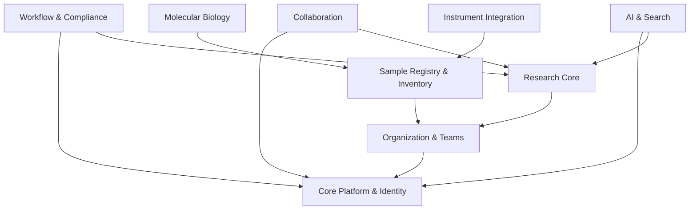
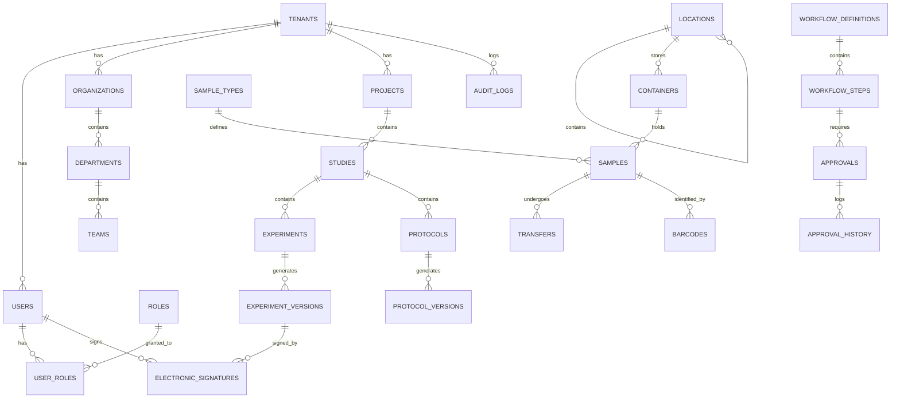

# Enterprise ELN Database Specification (V2)

## 1. Architecture Principles & Multi-Tenancy

To ensure this Version 1 (v1) is practical yet enterprise-ready, we follow these core principles:
*   **Multi-Tenancy**: A universally applied `tenant_id` on all top-level entities guarantees data isolation. 
*   **Modularity**: Each domain is loosely coupled.
*   **Auditability**: Trigger-based auditing for GxP tables.
*   **Practicality**: We are not over-engineering. Advanced features like complex graph querying are deferred to future phases.

---

## 2. System Modules & Dependency Diagram

### Dependency Diagram (Mermaid)

---

## 3. Detailed Table Specifications

### Core Platform & Identity (Phase 1)

**1. `tenants`**
*   **Purpose**: Root isolation for SaaS/Multi-department.
*   **Columns**: `id` (UUID), `name` (VARCHAR), `domain` (VARCHAR), Audit/SoftDelete cols.
*   **PK**: `id` | **Constraints**: Unique(`domain`) | **Indexes**: B-Tree(`domain`)
*   **Audit**: Yes | **Soft Delete**: Yes | **Versioning**: No | **Partitioning**: No

**2. `users`**
*   **Purpose**: Authenticatable entities.
*   **Columns**: `id` (UUID), `tenant_id` (UUID), `email` (VARCHAR), `password_hash` (VARCHAR), `first_name`, `last_name`, `status` (ENUM), Audit/SoftDelete cols.
*   **PK**: `id` | **FK**: `tenant_id` -> `tenants`
*   **Constraints**: Unique(`tenant_id`, `email`) | **Indexes**: B-Tree(`tenant_id`, `email`)
*   **Audit**: Yes | **Soft Delete**: Yes | **Versioning**: No | **Partitioning**: No

*(Other Identity tables: `roles`, `permissions`, `user_roles`, `role_permissions` follow standard M:M RBAC patterns. Phase 1.)*

### Organization (Phase 1)

**3. `organizations` -> `departments` -> `teams`**
*   **Purpose**: Hierarchical structure. All require `tenant_id`.
*   **Columns (teams)**: `id`, `tenant_id`, `department_id`, `name`, Audit/SoftDelete cols.
*   **PK**: `id` | **FK**: `tenant_id` -> `tenants`, `department_id` -> `departments`
*   **Audit**: Yes | **Soft Delete**: Yes | **Versioning**: No | **Partitioning**: No

### Research Core (Phase 1)

**4. `projects` & `studies`**
*   **Purpose**: Grouping of scientific work.
*   **Columns (projects)**: `id`, `tenant_id`, `name`, `description`, Audit/SoftDelete.
*   **PK**: `id` | **FK**: `tenant_id` -> `tenants`
*   **Audit**: Yes | **Soft Delete**: Yes | **Versioning**: No | **Partitioning**: No

**5. `experiments` & `protocols`**
*   **Purpose**: Active workspaces for scientific procedures.
*   **Columns (experiments)**: `id`, `tenant_id`, `study_id`, `title`, `content` (JSONB), `status` (ENUM).
*   **PK**: `id` | **FK**: `tenant_id` -> `tenants`, `study_id` -> `studies`
*   **Indexes**: B-Tree(`tenant_id`, `study_id`), GIN(`content`)
*   **Audit**: Yes | **Soft Delete**: Yes | **Versioning**: Yes | **Partitioning**: No

**6. `experiment_versions`**
*   **Purpose**: Immutable snapshots for compliance.
*   **Columns**: `id`, `tenant_id`, `experiment_id`, `version_number`, `snapshot_data` (JSONB), `created_at`.
*   **PK**: `id` | **FK**: `experiment_id` -> `experiments`
*   **Audit**: Yes | **Soft Delete**: No | **Versioning**: N/A | **Partitioning**: No

### Sample Registry & Inventory (Phase 1 & 2)

**7. `sample_types` (Phase 2)**
*   **Purpose**: Dynamic schema definition for sample categories (e.g., 'Plasmid', 'Cell Line').
*   **Columns**: `id`, `tenant_id`, `name`, `schema_definition` (JSONB).
*   **Audit**: Yes | **Soft Delete**: Yes | **Versioning**: No

**8. `samples` (Phase 1)**
*   **Purpose**: The actual scientific entities.
*   **Columns**: `id`, `tenant_id`, `sample_type_id` (Nullable for V1), `name`, `metadata` (JSONB).
*   **PK**: `id` | **FK**: `tenant_id`, `sample_type_id` -> `sample_types`
*   **Indexes**: GIN(`metadata`)
*   **Audit**: Yes | **Soft Delete**: Yes | **Versioning**: No | **Partitioning**: No

**9. `locations` & `containers` & `transfers` (Phase 1)**
*   **Purpose**: Physical storage tracking. Adjacency list for locations.
*   **Audit**: Yes | **Soft Delete**: Yes (Transfers are No/Immutable).

**10. `barcodes` (Phase 2)**
*   **Purpose**: Global uniqueness for physical labels.
*   **Columns**: `id`, `tenant_id`, `entity_type`, `entity_id`, `barcode_value` (VARCHAR), `symbology` (VARCHAR).
*   **Constraints**: Unique(`tenant_id`, `barcode_value`)

### Workflow & Compliance (Phase 1 & 2)

**11. `audit_logs` (Phase 1)**
*   **Purpose**: Immutable system-wide trail.
*   **Columns**: `id`, `tenant_id`, `table_name`, `record_id`, `action`, `old_values`, `new_values`, `performed_by`, `performed_at`.
*   **Indexes**: B-Tree(`tenant_id`, `record_id`), B-Tree(`performed_at`)
*   **Audit**: No | **Soft Delete**: No | **Partitioning**: YES (Range by `performed_at` month).

**12. `electronic_signatures` (Phase 1)**
*   **Purpose**: 21 CFR Part 11 compliant signatures.
*   **Columns**: `id`, `tenant_id`, `entity_type`, `entity_id`, `signed_by`, `meaning`, `snapshot_hash` (VARCHAR).
*   **Audit**: Yes | **Soft Delete**: No | **Partitioning**: No

**13. `workflow_definitions`, `workflow_steps`, `approvals`, `approval_history` (Phase 2)**
*   **Purpose**: Dynamic routing engine for complex organization sign-offs.

### Collaboration (Phase 1)

**14. `comments`, `attachments`, `notifications`**
*   **Purpose**: Standard collaboration tools.
*   **Columns (attachments)**: `id`, `tenant_id`, `entity_type`, `entity_id`, `file_url`, `file_name`, `mime_type`, `size_bytes`.

### Molecular Biology (Phase 2)

**15. `sequences`, `sequence_annotations`, `constructs`, `primers`, `vectors`**
*   **Purpose**: Domain-specific biological data.
*   **Columns (sequences)**: `id`, `tenant_id`, `sample_id`, `sequence_data` (TEXT), `topology` (ENUM).

### AI & Search (Phase 3)

**16. `ai_conversations`, `ai_messages`, `vector_embeddings`, `prompt_templates`**
*   **Purpose**: Contextual memory and RAG infrastructure.
*   **Columns (vector_embeddings)**: `id`, `tenant_id`, `entity_type`, `entity_id`, `content`, `embedding` (VECTOR).
*   **Indexes**: HNSW on `embedding`.

### System & Automation (Phase 3)

**17. `api_keys`, `feature_flags`, `system_settings`, `background_jobs`**
*   **Purpose**: External integrations, async tasks, platform configs.

---

## 4. Mermaid ER Diagram

---

## 5. Implementation Priority (Classification)

### Phase 1: Required for MVP (The Foundation)
These tables are sufficient to build the core ELN application required by the business immediately.
*   **Platform**: `tenants`, `users`, `roles`, `permissions`, `user_roles`, `role_permissions`
*   **Organization**: `organizations`, `departments`, `teams`, `user_teams`
*   **Research**: `projects`, `studies`, `experiments`, `protocols`, `experiment_versions`, `protocol_versions`
*   **Registry & Inventory**: `samples` (generic JSONB), `locations`, `containers`, `transfers`
*   **Compliance & Collab**: `audit_logs`, `electronic_signatures`, `attachments`, `comments`, `notifications`

### Phase 2: Required Post-MVP (The Enterprise Upgrade)
These add deep domain capabilities and dynamic routing.
*   **Registry**: `sample_types`, `barcodes`
*   **Molecular Bio**: `sequences`, `sequence_annotations`, `constructs`, `primers`, `vectors`
*   **Workflow**: `workflow_definitions`, `workflow_steps`, `approvals`, `approval_history`

### Phase 3: Advanced Enterprise (The Future)
These unlock automation, instrumentation, and artificial intelligence.
*   **AI**: `vector_embeddings`, `ai_conversations`, `ai_messages`, `prompt_templates`, `search_history`
*   **Instruments**: `instrument_vendors`, `instrument_models`, `instruments`, `instrument_runs`, `instrument_files`
*   **Automation**: `api_keys`, `feature_flags`, `system_settings`, `background_jobs`

---

## 6. Implementation Roadmap

To build this systematically without overwhelming the team, follow this chronological execution roadmap:

1.  **Sprint 1**: Database Infrastructure & Identity Layer (`tenants`, `users`, RBAC, Auth).
2.  **Sprint 2**: Organization Hierarchy & Base Audit System (`organizations`, `teams`, `audit_logs` triggers).
3.  **Sprint 3**: Research Workspace (`projects`, `studies`, `experiments`, `protocols`).
4.  **Sprint 4**: Physical World & Assets (`locations`, `containers`, `samples`, `attachments`).
5.  **Sprint 5**: Compliance & Sign-off (`experiment_versions`, `electronic_signatures`, `comments`).
*(End of MVP / Phase 1)*
6.  **Sprint 6**: Structured Registry & Workflows (`sample_types`, `workflow_definitions`).
7.  **Sprint 7**: Biological Domain (`sequences`, `constructs`).
8.  **Sprint 8+**: AI Assistant, Background Jobs, and Instruments.
