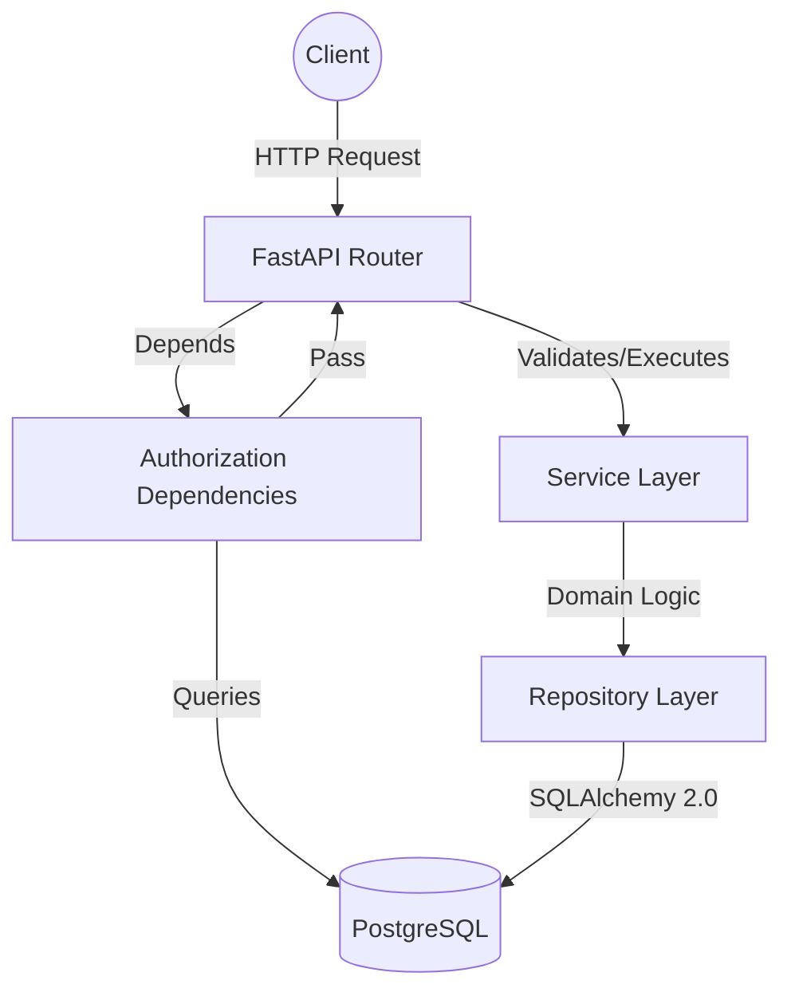
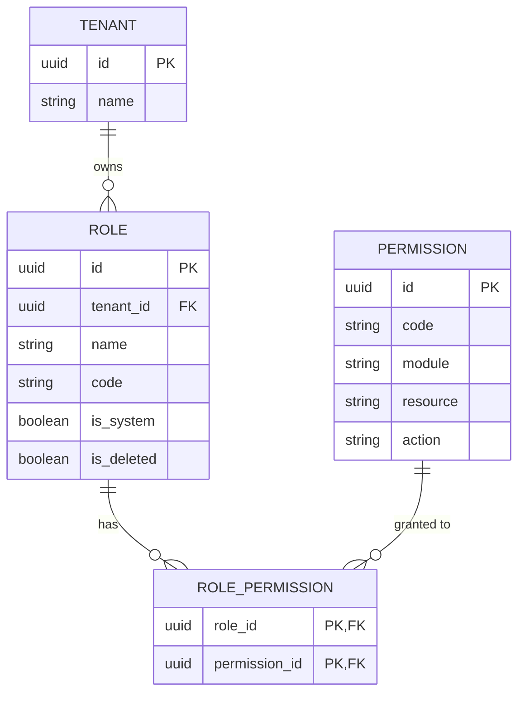

# Role-Based Access Control (RBAC) Architecture

## Overview
The RBAC module serves as the foundational security perimeter for the Enterprise AI-Powered Electronic Laboratory Notebook (ELN). It enforces strict, granular access control by decoupling user identity from system permissions. Instead of assigning permissions directly to users, permissions are assigned to **Roles**, which are in turn assigned to users. 

Crucially, this RBAC system is designed for a **multi-tenant** SaaS environment, ensuring absolute data isolation between different organizations (Tenants) while maintaining a globally standardized permission matrix.

---

## Layered Architecture

The RBAC module strictly adheres to Clean Architecture principles, ensuring a unidirectional flow of dependencies:

1. **API Routing Layer (`app/api/v1/endpoints`)**: Handles HTTP requests, Pydantic validation, and JSON serialization. Contains zero business logic.
2. **Authorization Dependency Layer (`app/core/security/authorization.py`)**: Intercepts requests, evaluates JWT claims, fetches tenant context, and verifies database permission mappings before yielding to the router.
3. **Service Layer (`app/services/rbac`)**: The core brain. Coordinates repositories, validates domain rules (e.g., preventing duplicate assignments, enforcing strict `module.resource.action` nomenclature), and translates domain failures into HTTP-ready exceptions.
4. **Repository Layer (`app/crud`)**: Pure SQLAlchemy 2.0 Async database interactions. Handles session management, soft deletes, and complex multi-table joins.
5. **Database Models (`app/models/rbac.py`)**: The raw PostgreSQL ORM definitions mapping table structures.

---

## Database Design

The database schema utilizes three primary tables to manage RBAC:

1. **`roles`**: Represents a collection of permissions. Roles are inherently scoped to a specific `tenant_id` to prevent cross-organization pollution. System-level roles are flagged with `is_system=True` to prevent accidental deletion.
2. **`permissions`**: A global registry of system capabilities. Permissions are NOT scoped by tenant; they are uniform across the entire platform.
3. **`role_permissions`**: The associative (many-to-many) bridge table linking a Role to multiple Permissions.

---

## Tenant Isolation Strategy

Tenant isolation is treated as a critical security mandate, enforced at multiple layers:
1. **Model Level**: The `Role` model requires a non-nullable `tenant_id`.
2. **Repository Level**: Every CRUD operation on `roles` (e.g., `get_by_code`, `delete`) explicitly requires the `tenant_id` parameter in the `WHERE` clause.
3. **Service Level**: Before modifying a role's permissions, the `RolePermissionService` retrieves the target role and asserts that its `tenant_id` exactly matches the authenticated user's `current_tenant.id`. If a mismatch occurs, a `TenantIsolationError` is raised immediately.

---

## Soft Delete Strategy

To preserve historical audit logs (FDA 21 CFR Part 11 Compliance), Roles are never physically `DELETE`d from the database. 
- The `SoftDeleteMixin` adds an `is_deleted` boolean and `deleted_at` timestamp.
- When `role_service.delete_role()` is invoked, it sets `is_deleted = True`.
- All `Repository` lookup methods append `.where(cls.is_deleted == False)` by default, rendering the role functionally invisible to the application while preserving referential integrity for historical `AuditLogs` or `WorkflowApprovals`.

---

## Permission Nomenclature

To prevent chaotic naming conventions, permissions must adhere strictly to a three-part dot-notation string: `<module>.<resource>.<action>`.
* **Module**: The overarching domain (e.g., `inventory`, `rbac`).
* **Resource**: The specific entity (e.g., `sample`, `role`).
* **Action**: The operation (e.g., `create`, `read`, `transfer`).

**Example**: `inventory.sample.transfer`

The `PermissionService` intercepts all incoming creation requests, splits the code, and verifies that the parts match exactly before allowing database insertion.
